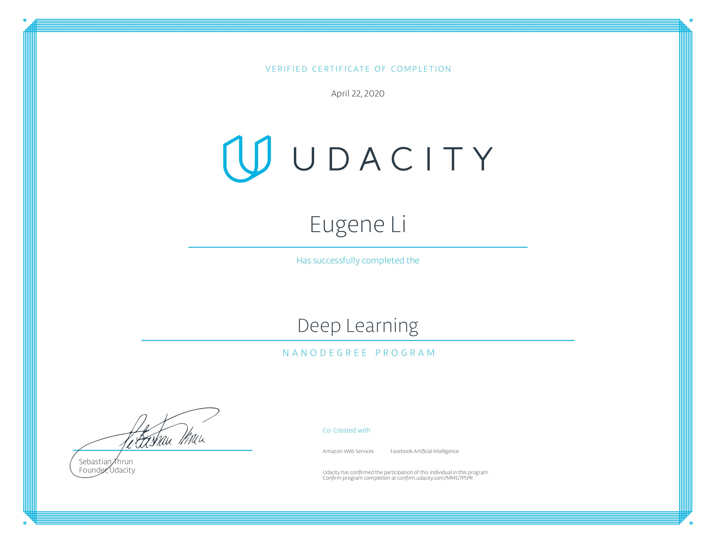

# udacity-deep-learning

This repo documents my completion of Udacity's 4-month-long [Deep Learning Nanodegree](https://www.udacity.com/course/deep-learning-nanodegree--nd101) during the [1 month free access offer](https://www.udacity.com/legal/en-us/one-month-free-access).

## Syllabus
You can view the syllabus [here.](syllabus.pdf)

## Certificate

